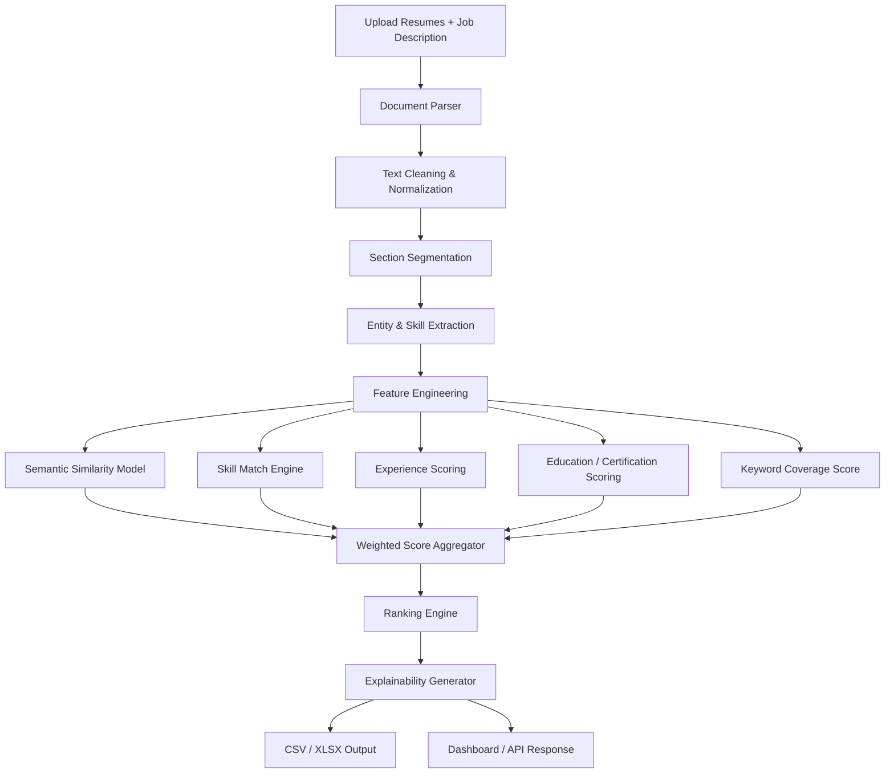

I cannot promise a 100% win, but I can give you a setup that looks serious, polished, and judge-friendly.

Below is a **complete README blueprint** you can paste into your repo and also feed to an LLM to generate code from. It is designed for an **AI Resume Ranker** that feels more than a toy: explainable, modular, reproducible, and impressive in a demo.

---

# AI Resume Ranker

An explainable, hybrid AI system that ranks candidate resumes against a job description using a combination of semantic similarity, skill matching, experience scoring, and education relevance.

## 1. Problem Statement

Hiring teams receive many resumes for a single role. Manually screening them is slow, inconsistent, and often subjective.
This project builds an AI-powered resume ranking system that:

* reads resumes in PDF/DOCX format,
* extracts structured candidate information,
* compares each candidate against a target job description,
* assigns an interpretable score,
* generates a ranked shortlist in CSV/XLSX format.

The goal is to help recruiters quickly identify the most relevant candidates while keeping the ranking explainable and fair.

---

## 2. What We Built

This project is a **hybrid resume ranking engine** with 4 layers:

1. **Document ingestion layer**
   Accepts resumes and job description input, then converts documents into clean text.

2. **Information extraction layer**
   Extracts skills, experience, education, projects, certifications, tools, and keywords.

3. **Ranking intelligence layer**
   Computes a final match score using:

   * semantic similarity,
   * skill overlap,
   * experience relevance,
   * education fit,
   * keyword coverage,
   * penalty checks for missing critical requirements.

4. **Output and explainability layer**
   Produces:

   * ranked candidate list,
   * match breakdown per candidate,
   * confidence/explanation fields,
   * CSV/XLSX output for submission.

---

## 3. Why This Approach

A simple keyword matcher is easy to fool. A pure LLM scorer can be expensive and inconsistent.
This project uses a **hybrid system** because it is stronger in real hiring settings:

* **Semantic matching** catches resumes that use different wording but mean the same thing.
* **Skill overlap** ensures hard requirements are not missed.
* **Experience scoring** rewards relevant years and job history.
* **Education and certification relevance** help differentiate strong candidates.
* **Explainability** makes the ranking trustworthy and easy to defend.

This is the kind of system judges like because it shows practical AI thinking, not just model buzzwords.

---

## 4. Core Features

* Resume parsing from PDF and DOCX
* Job description parsing
* Skill extraction with synonym support
* Semantic embedding-based matching
* Weighted ranking score
* Explainable score breakdown
* Export to CSV and XLSX
* Clean, reproducible pipeline
* Configurable scoring weights
* Fairness-aware penalties for missing critical requirements
* Optional UI or API for easy demo

---

## 5. Solution Architecture



---

## 6. End-to-End Workflow

### Step 1: Input

User uploads:

* one job description file or pasted text,
* multiple candidate resumes.

### Step 2: Parsing

The system reads files and extracts raw text using:

* PDF parser,
* DOCX parser,
* OCR fallback for scanned resumes.

### Step 3: Cleaning

The text is cleaned by:

* removing repeated whitespace,
* fixing broken line structure,
* removing headers/footers where possible,
* standardizing punctuation,
* converting text to lowercase for matching.

### Step 4: Section Detection

The system splits resume text into sections such as:

* summary,
* skills,
* experience,
* projects,
* education,
* certifications.

### Step 5: Feature Extraction

For each candidate, the system extracts:

* skill tokens,
* years of experience,
* role relevance,
* project relevance,
* education level,
* certifications,
* tool stack,
* job-title similarity.

### Step 6: Matching

Each candidate is compared against the job description using:

* **semantic embedding similarity**
* **required skill coverage**
* **nice-to-have skill coverage**
* **experience alignment**
* **education alignment**
* **project relevance**

### Step 7: Scoring

Each factor is converted into a normalized score and combined into a final score from 0 to 100.

### Step 8: Ranking

Candidates are sorted in descending order of final score.

### Step 9: Explanation

For every candidate, the system generates reasons such as:

* matched key skills,
* matched years of experience,
* strong project overlap,
* missing critical skills,
* education match.

### Step 10: Export

Final ranked file is exported in:

* `.csv`
* `.xlsx`

---

## 7. Scoring Logic

Use a weighted hybrid scoring model.

### Final Score Formula

```text
Final Score =
  0.30 × Semantic Similarity +
  0.25 × Skill Match Score +
  0.20 × Experience Score +
  0.10 × Education Score +
  0.10 × Project Relevance Score +
  0.05 × Keyword Coverage Score
```

### Recommended Weighting

* **Semantic Similarity (30%)**
  Captures overall meaning and context.

* **Skill Match (25%)**
  Checks how many required skills are present.

* **Experience (20%)**
  Rewards candidates with relevant work history.

* **Education (10%)**
  Helps when degree or specialization matters.

* **Project Relevance (10%)**
  Useful for fresher or portfolio-based hiring.

* **Keyword Coverage (5%)**
  Keeps the system grounded in exact role requirements.

### Bonus / Penalty Rules

* Add bonus if candidate has all must-have skills.
* Add bonus if candidate has role-specific project experience.
* Apply penalty if critical requirements are missing.
* Apply penalty if experience is clearly unrelated.
* Apply small bonus for certifications relevant to the job.

---

## 8. Unique Twist That Makes It Stand Out

This is not just “rank resumes by keywords.”
The standout version should include these 5 ideas:

### A. Explainable ranking

Each score must have a breakdown:

* why candidate got ranked high,
* what matched,
* what was missing.

### B. Skill synonym mapping

Example:

* “ML” → “Machine Learning”
* “JS” → “JavaScript”
* “Postgres” → “PostgreSQL”
* “NLP” → “Natural Language Processing”

This avoids dumb keyword misses.

### C. Hybrid evidence scoring

A skill should count more if it appears in:

* skills section,
* project section,
* experience section,
* and also semantically matches the JD.

That makes the ranking smarter.

### D. Fairness guardrails

Do not rank based on name, gender, age, photo, or irrelevant personal details.
Only rank on job relevance.

### E. Candidate fit explanation

For each candidate, produce:

* matched skills,
* missing skills,
* top evidence lines,
* final score reason.

This makes the system demo-friendly and judge-friendly.

---

## 9. Suggested Tech Stack

### Backend / Processing

* Python
* pandas
* numpy
* scikit-learn
* sentence-transformers
* spaCy or NLTK
* pdfplumber or PyMuPDF
* python-docx
* openpyxl

### Optional OCR

* pytesseract
* Pillow

### Optional UI

* Flask or FastAPI
* HTML/CSS/Bootstrap or React

### Output

* CSV
* XLSX

---

## 10. Project Structure

```bash
resume-ranker/
├── data/
│   ├── resumes/
│   ├── job_description/
│   └── output/
├── models/
│   └── embeddings/
├── src/
│   ├── parser.py
│   ├── cleaner.py
│   ├── section_splitter.py
│   ├── skill_extractor.py
│   ├── experience_extractor.py
│   ├── scoring.py
│   ├── ranker.py
│   ├── exporter.py
│   └── utils.py
├── app/
│   ├── main.py
│   ├── templates/
│   └── static/
├── notebooks/
├── tests/
├── requirements.txt
├── README.md
└── .gitignore
```

---

## 11. Detailed Module Design

### `parser.py`

Reads PDF/DOCX files and converts them into raw text.

### `cleaner.py`

Cleans noisy text and standardizes formatting.

### `section_splitter.py`

Detects resume sections using heading patterns and heuristics.

### `skill_extractor.py`

Extracts technical and soft skills using:

* keyword dictionaries,
* synonym mapping,
* optional NLP matching.

### `experience_extractor.py`

Estimates:

* years of experience,
* job titles,
* relevance to target role,
* project depth.

### `scoring.py`

Calculates:

* semantic similarity,
* skill score,
* experience score,
* education score,
* project score,
* final weighted score.

### `ranker.py`

Sorts candidates by score and applies tie-break logic.

### `exporter.py`

Writes final ranking to CSV/XLSX with explanation columns.

---

## 12. Data Flow Details

### Input fields

For each resume:

* filename
* extracted text
* skills
* experience summary
* education summary
* projects
* certifications

For the job description:

* role title
* required skills
* preferred skills
* minimum experience
* education requirement
* responsibilities

### Output fields

Each ranked row should include:

* Rank
* Candidate Name
* Resume File
* Final Score
* Semantic Score
* Skill Score
* Experience Score
* Education Score
* Project Score
* Keyword Score
* Matched Skills
* Missing Skills
* Notes / Explanation

---

## 13. Tie-Break Rules

If two candidates have similar scores:

1. higher must-have skill match wins,
2. higher semantic similarity wins,
3. better experience relevance wins,
4. stronger project evidence wins,
5. earlier file order as final fallback.

This makes ranking deterministic.

---

## 14. Evaluation Method

To show the project is solid, test it on:

* at least 20–50 resumes,
* 2–3 different job descriptions,
* both fresher and experienced profiles.

Measure:

* top-5 precision,
* top-10 relevance,
* manual judge agreement,
* explanation quality.

If possible, show a small comparison:

| Method        | Strength | Weakness                  |
| ------------- | -------- | ------------------------- |
| Keyword-only  | fast     | easy to fool              |
| LLM-only      | flexible | expensive / inconsistent  |
| Hybrid system | balanced | slightly more engineering |

That comparison looks strong in a presentation.

---

## 15. Demo Story

Your demo should say:

> “We built a hybrid resume ranker that combines semantic AI with rule-based scoring. It ranks resumes against a job description, explains every score, and exports a shortlist that a recruiter can use immediately.”

That sentence sounds sharp and professional.

---

## 16. How to Run

```bash
git clone https://github.com/your-username/resume-ranker.git
cd resume-ranker
pip install -r requirements.txt
python src/ranker.py
```

If using a web app:

```bash
python app/main.py
```

---

## 17. Output Example

```csv
Rank,Candidate Name,Final Score,Semantic Score,Skill Score,Experience Score,Education Score,Project Score,Keyword Score,Matched Skills,Missing Skills
1,Rahul Sharma,91.4,0.92,0.95,0.85,0.90,0.88,0.80,"Python, SQL, Machine Learning","Docker"
2,Priya Singh,88.7,0.90,0.91,0.82,0.95,0.84,0.78,"Python, NLP, Flask","Kubernetes"
3,Amit Patel,86.1,0.87,0.89,0.80,0.88,0.82,0.75,"Data Analysis, Pandas, Excel","None"
```

---

## 18. README Sections You Should Keep in Final Submission

Your final repo README should include:

* project overview
* problem statement
* approach
* architecture diagram
* scoring formula
* setup instructions
* output format
* screenshots
* limitations
* future improvements
* team members

---

## 19. Future Improvements

Add these if you want the project to feel premium:

* LLM-based resume summarization
* multi-job ranking
* recruiter filters
* bias audit report
* explainable highlights in UI
* PDF preview with matched skill highlights
* ATS compatibility score
* recommendation of missing skills for each candidate

---

## 20. Limitations

Be honest in the README:

* OCR may fail on low-quality scans
* some resumes are poorly formatted
* semantic models may miss domain-specific jargon
* ranking is a decision support tool, not a final hiring decision

This honesty actually helps your credibility.

---

## 21. Final Pitch

This project is built to be:

* practical,
* explainable,
* reproducible,
* and easy to demo.

It does not just rank candidates.
It tells the recruiter **why** a candidate is ranked there.

That is the part judges remember.

---

## 22. Prompt You Can Feed to an LLM to Generate Code

```text
Build a complete AI Resume Ranker in Python.

Goal:
- Input: a job description and multiple resumes in PDF/DOCX.
- Output: a ranked CSV/XLSX with candidate scores and explanations.

Requirements:
1. Parse PDF and DOCX resumes.
2. Clean and normalize text.
3. Extract sections: skills, experience, education, projects, certifications.
4. Extract job requirements from the job description.
5. Compute a hybrid score using:
   - semantic similarity,
   - skill match,
   - experience match,
   - education match,
   - project relevance,
   - keyword coverage.
6. Use a weighted final score from 0 to 100.
7. Produce explanations for each candidate.
8. Export ranked results to CSV and XLSX.
9. Structure code into modules:
   parser.py, cleaner.py, extractor.py, scoring.py, ranker.py, exporter.py.
10. Add a simple Flask or FastAPI UI optional.
11. Make the code clean, modular, and production-like.
12. Include sample data handling and error handling.
13. Add README instructions and a sample output schema.

Use Python libraries:
- pandas
- numpy
- scikit-learn
- sentence-transformers
- pdfplumber or PyMuPDF
- python-docx
- openpyxl
- Flask or FastAPI if UI is added

Keep the solution explainable and judge-friendly.
```

---

If you want, I can turn this into a **real polished README.md file** with proper GitHub formatting and also give you a **full folder-by-folder build plan** for the code.
